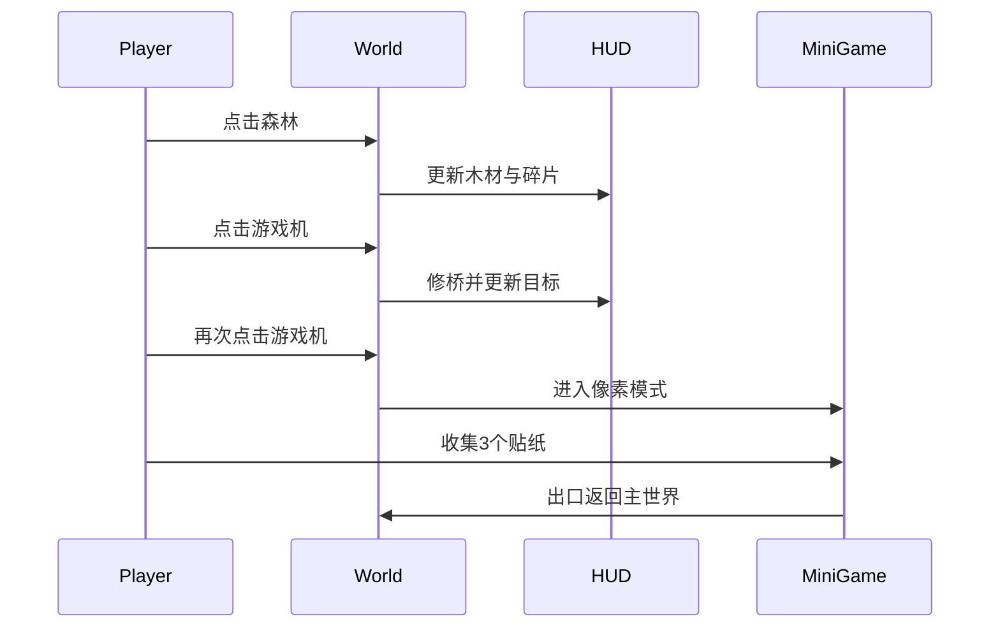
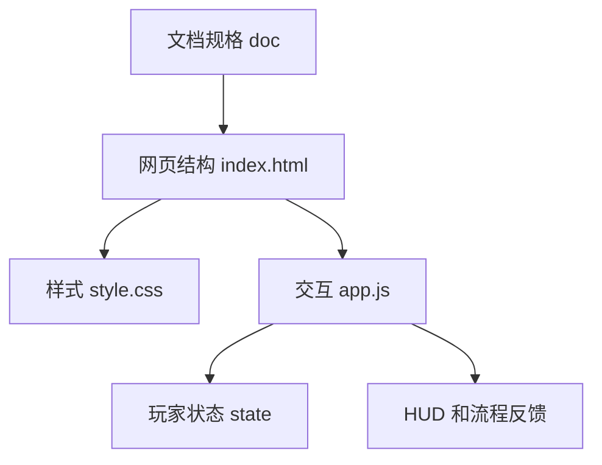
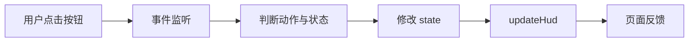

# 表情探索：情绪小镇项目完成与审核报告

版本：v1 规划版与网页概念演示。

## 系统认知层的关键结论和对应源码位置

- 项目本质：当前是 0-1 阶段的小游戏设计与概念交互演示，不是完整游戏工程。位置：`README.md`、`doc/design_document.md`。
- 核心闭环：木屋 -> 森林拾取 -> 修桥 -> 游戏机 -> 像素贴纸 -> 返回主世界。位置：`app.js` 的 `handleWorldAction`、`collectSticker`、`exitMiniGame`。
- 关键状态：`wood`、`stickers`、`shards`、`bridgeRepaired`、`inPixelMode`、`completed`。位置：`app.js` 的 `state`。
- 画面标准：80 分以上通过，当前 v1 自评分 87/100。位置：`doc/visual_alignment_standard.md`。
- 行为路径与技术拆分：玩家每一步的状态和反馈已写入规格。位置：`doc/interaction_technical_spec.md`。

## 系统认知层

### 1. 项目概述

针对版本：v1。

功能目的：项目用于验证一个现代情绪冒险小游戏的最小闭环。玩家操控动态表情包主角，在小地图中完成资源拾取、修桥、进入游戏机、像素小游戏收集贴纸、返回主世界的流程。

层次概念：项目分为三层。第一层是游戏体验层，定义主世界、像素小游戏和情绪能力。第二层是交互状态层，定义玩家位置、资源、小游戏完成状态和 HUD 反馈。第三层是实现承载层，当前由网页概念演示承载，后续由 Unity 桌面原生版承载。

专家视角下的项目本质：这是一个先把“体验闭环和状态闭环”想透的垂直切片，不是内容型大地图项目。当前最重要的价值是确认玩家路径、视觉节点、数据状态和可实现架构能够一一对应。

项目对标和参考：主要吸收小岛生活、木屋和资源采集、定点微建造、现代入口风格和像素模式切换。详细权重与评分保存在 `doc/visual_alignment_standard.md`，README 不再展示对标内容。

核心原则：架构风格采用小型状态机 + 场景节点交互 + 本地存档。代码规范遵循 4 空格缩进、清晰命名、最小依赖。行业合规要求包括不使用未授权素材、不复制受版权保护画面、不把用户资源或生成产物误提交。架构设计原则为小闭环优先、状态可追踪、节点可拆分、桌面原生实现可复用。

设计哲学：先做可读路径，再做可玩反馈，最后做画面精度。每个视觉元素必须服务玩家下一步行动；每个交互必须产生可见反馈和数据变化；每个设计点必须能映射到 Unity 场景、脚本或数据。

适合理解该项目的视角：用“玩家 5 分钟是否能完成第一轮闭环”来读设计，用“每个节点是否有状态变化”来读代码，用“是否达到 80 分质量门禁”来读画面标准。

项目目录树：

```text
xiangsu/
  README.md                         游戏说明
  index.html                        网页概念演示入口
  style.css                         网页演示画面样式
  app.js                            交互状态与流程逻辑
  implementation_plan.md            实施计划与质量门禁
  PROJECT_AUDIT_REPORT.md           本报告
  doc/
    design_document.md              游戏设计规划
    level_sketches.md               关卡与节点草图
    interaction_technical_spec.md   行为路径与接口规格
    visual_alignment_standard.md    画面对齐与评分标准
  assets/
    README.md                       素材目录说明
```

技术栈和技术方案列举：

- HTML：承载当前概念演示结构。
- CSS：绘制小地图、HUD、像素小游戏预览和响应式布局。
- JavaScript：维护玩家状态、交互流程和 UI 更新。
- Unity：后续桌面原生版建议使用单工程多平台打包。
- 本地 JSON：后续桌面版存档格式。
- localStorage：网页演示阶段可作为本地状态兜底方案，目前未强制写入。

本地开发最小环境与依赖缺失兜底方案：当前只需要浏览器即可打开 `index.html`。如果浏览器无法加载本地文件，可用任意静态服务器打开根目录。后续 Unity 阶段如果本机缺少 Unity，应先保持网页演示和文档可用，不阻塞设计确认。

## 结构控制层

### 2. 核心模块分析

针对版本：v1。

模块职责：

- 入口模块：`index.html`，定义 HUD、主世界节点、情绪按钮、像素小游戏按钮。
- 状态模块：`app.js` 的 `state`，保存资源、位置、桥和小游戏完成状态。
- 情绪模块：`emotionMeta` 与 `setEmotion`，维护三种能力的文案和视觉状态。
- 世界交互模块：`handleWorldAction`，处理木屋、森林、桥、游戏机入口。
- 像素小游戏模块：`collectSticker` 与 `exitMiniGame`，处理贴纸收集和返回主世界。
- 视图同步模块：`updateHud` 与 `moveAvatar`，更新 HUD、流程列表、角色位置。
- 样式模块：`style.css`，表达小地图、河流、桥、游戏机、像素关卡。
- 文档模块：`doc/`，保存设计、交互和评分标准。

类层次结构：当前无类，采用静态页面 + 函数式状态管理。后续 Unity 建议映射为 `PlayerController`、`EmotionController`、`WorldNodeInteractor`、`MiniGameStateMachine`、`SaveService`。

核心模块简化代码：

```js
function handleWorldAction(action) {
    if (action === "forage") addResource();
    if (action === "arcade" && state.wood < 1) return showHint();
    if (action === "arcade" && !state.bridgeRepaired) repairBridge();
    if (action === "arcade" && state.bridgeRepaired) enterPixelMode();
    updateHud();
}
```

关键流程时序图：



模块选择说明：请求中提到 Flask、ctx、url_map、wrappers、blueprints。当前项目不是 Flask 项目，没有 Flask 类、请求上下文、路由表、请求/响应包装器或蓝图系统。对应概念在本项目中分别映射为入口页面、前端状态、按钮事件、UI 更新函数和后续 Unity 场景拆分。

### 3. 依赖关系图

针对版本：v1。

模块依赖分析：`index.html` 依赖 `style.css` 和 `app.js`。`app.js` 依赖 DOM 节点存在，不依赖第三方库。`style.css` 只依赖 HTML 类名和 ID。`doc/` 文档不参与运行，但约束后续实现。

外部依赖分析：当前无 npm、无 CDN、无远程 API 调用。运行风险主要来自浏览器兼容性和 DOM 节点 ID 变更。

分层结构图：



请求生命周期数据流图：



### 4. 设计模式识别

针对版本：v1。

设计思路：当前使用轻量状态机和事件驱动。原因是 MVP 交互少、状态有限，使用集中状态对象能让行为路径更容易审计。后续 Unity 可以把当前状态机拆到独立组件中。

设计模式实现要点：

```js
function collectSticker(button) {
    if (!state.inPixelMode) return;
    if (button.classList.contains("collected")) return;
    button.classList.add("collected");
    state.stickers += 1;
    state.objective = state.stickers >= 3 ? "打开出口" : "继续收集";
    updateHud();
}
```

深度控制逻辑实例：贴纸收集必须先满足 `inPixelMode`，避免玩家在主世界误点小游戏资源；贴纸按钮已收集后直接返回，避免重复计数；达到 3 个贴纸后出口变为 ready。

### 5. 扩展机制设计

针对版本：v1。

蓝图系统：当前没有 Flask 蓝图。后续可把 Unity 场景视为功能蓝图：`WorldHub` 负责主世界，`MiniGame01` 负责像素关卡，`SharedUI` 负责 HUD 和提示。

应用工厂：当前无应用工厂。后续 Unity 可用 `GameBootstrap` 初始化 `PlayerState`、`SaveService` 和场景入口。

扩展点设计：新增资源节点只需增加 `WorldNode` 数据和交互处理；新增小游戏只需增加 `miniGameId`、入口节点、小游戏状态机和结算逻辑；新增情绪能力需要扩展 `EmotionMode`、UI 文案和能力处理。

扩展挂载点：网页阶段挂载在按钮 `data-action` 与 `data-sticker`；Unity 阶段挂载在场景节点组件和 ScriptableObject 配置。

### 6. 以专家身份深度解析项目的设计和核心抽象：工程执行层

针对版本：v1。

核心抽象是“节点交互驱动的短闭环”。主世界不是开放内容容器，而是一个有明确目标的状态图。木屋提供起点和回收点，森林提供资源，桥提供条件门，游戏机提供模式切换，像素关卡提供奖励，贴纸墙提供闭环完成反馈。

工程上最关键的是防止状态散落。`state` 当前集中保存所有关键字段，后续 Unity 应保持类似结构，避免把桥是否修好、贴纸数量、小游戏完成状态分散在多个 GameObject 的临时字段里。

## 工程执行层

### 7. 代码质量评估

针对版本：v1。

当前代码规模小、依赖少、流程清晰，适合概念验证。主要问题是没有自动测试、没有持久化、没有键盘控制和无障碍细节仍有限。整体可读性合格，后续进入 Unity 前应把状态机抽成更稳定的数据模型。

核心算法 1：世界节点交互判断。

```js
if (action === "arcade") {
    if (state.wood < 1) return showNeedWood();
    if (!state.bridgeRepaired) return repairBridge();
    return enterPixelMode();
}
```

复杂度：O(1)，只判断当前动作和少量状态。

核心算法 2：贴纸收集。

```js
for (const sticker of stickers) {
    if (sticker.clicked && !sticker.collected) {
        sticker.collected = true;
        state.stickers += 1;
    }
}
```

复杂度：O(n)，n 为贴纸数量。v1 固定为 3，可视为常数。

核心算法 3：HUD 同步。

```js
for (const step of steps) {
    step.done = ruleMatches(step, state);
}
renderLocation(state.location);
renderInventory(state.inventory);
```

复杂度：O(n)，n 为流程步骤数量。当前固定 5。

核心函数：

- `updateHud`：把状态同步到 HUD、流程列表和出口可用态。
- `setEmotion`：切换情绪能力的视觉和描述。
- `handleWorldAction`：主世界节点交互入口。
- `collectSticker`：像素小游戏贴纸收集入口。
- `exitMiniGame`：小游戏完成后返回主世界。

核心数据结构：

```js
const state = {
    wood: 0,
    stickers: 0,
    bridgeRepaired: false,
    inPixelMode: false,
    completed: false,
};
```

关键 API 分析：

- DOM 查询 API：易用，但依赖 ID 稳定；当前未做空值防御，后续可补。
- DOM 事件 API：线程安全问题较低；需要防止重复点击造成重复计数，当前通过 collected 判断处理。
- classList/textContent/style API：足够安全，未使用 innerHTML，XSS 风险低。

组织、命名、文档、测试、工具链：文件组织清晰，命名贴合玩法；文档已补齐；暂无测试和构建工具链。建议后续加入 Playwright 冒烟测试和 Unity PlayMode 测试。

代码风格：可读性合格，错误处理偏轻，安全性在静态网页范围内可接受。后续若加入用户输入或远程资源，必须增加输入校验和资源白名单。

### 8. 开发者视角

针对版本：v1。

上手路径：先读 `README.md` 理解游戏，再读 `doc/design_document.md` 和 `doc/interaction_technical_spec.md`，然后打开 `index.html` 跑通闭环，最后读 `app.js` 的状态机。

环境准备：浏览器即可。后续 Unity 阶段准备 Unity 编辑器、Windows/macOS 打包模块和基础输入设备。

要读/跑内容：打开 `index.html`，按森林、游戏机、游戏机、三个贴纸、出口的顺序点击。

上手模块顺序：`state` -> `updateHud` -> `handleWorldAction` -> `collectSticker` -> `exitMiniGame` -> `style.css`。

高频任务索引：改玩法先改 `doc/interaction_technical_spec.md`；改画面标准先改 `doc/visual_alignment_standard.md`；改演示节点先改 `index.html` 和 `app.js`；改视觉先改 `style.css`。

变更安全清单：不要扩大地图；不要删除规范文档；不要把对标内容写回 README；不要引入未授权素材；不要让小游戏出口在贴纸不足时可完成。

常见故障排查索引：按钮无反应检查 ID 和事件绑定；贴纸重复计数检查 `collected`；游戏机无法进入检查 `wood` 和 `bridgeRepaired`；样式错位检查响应式断点。

推荐阅读的项目 doc 文档内容：`doc/visual_alignment_standard.md`、`doc/interaction_technical_spec.md`、`doc/level_sketches.md`。

### 9. 性能特征分析

针对版本：v1。

瓶颈识别：当前无明显性能瓶颈。页面元素少，DOM 操作少，所有核心操作都是常数级或小规模线性操作。

优化建议：保持无第三方依赖；避免把演示页做成重动画；后续 Unity 中对远景光效、粒子和水面反光设移动端/低配降级。

异步性能：当前没有异步请求。后续若加入资源加载，应使用加载状态和失败兜底。

性能测试数据：当前未接入性能测试。建议网页阶段用 Chrome Performance 记录首屏和点击链路；Unity 阶段用 Profiler 观察 CPU、GPU、GC Alloc。

测试和报告优先：当前应补充冒烟测试。关键指标包括首屏渲染时间、点击响应延迟、内存占用、控制台错误数。若将来有服务端，再增加 QPS、延迟分布、错误率。

调试技巧：先看 console；再用 DOM snapshot 检查节点；最后按状态字段逐步验证 `wood`、`stickers`、`bridgeRepaired`、`inPixelMode`。

### 10. 安全设计分析

针对版本：v1。

会话安全：当前无登录、无会话、无远程接口。

请求验证：当前无网络请求。后续如加入存档上传，需要校验 slotId、资源数量和小游戏完成记录。

CSRF/XSS 防护：当前不使用表单提交和远程写入，不使用 innerHTML，XSS 风险低。后续用户输入必须使用 textContent 或转义。

典型漏洞模式：未来风险包括加载不受信任素材、存档 JSON 被篡改、资源计数溢出、小游戏完成状态伪造。

内存管理：网页阶段由浏览器管理；Unity 阶段需控制贴图大小、粒子数量和频繁实例化。

依赖库安全性：当前无外部依赖，因此供应链风险低。

### 11. 维护性和扩展性

针对版本：v1。

优点：核心流程短，状态集中，文档和演示一致，后续 Unity 拆分路径明确。

缺点：网页演示没有模块化；没有测试；没有持久化；只支持点击，不支持真实移动。

扩展点设计：资源节点、情绪能力、小游戏入口、贴纸奖励都可以扩展，但必须先更新 `doc/interaction_technical_spec.md`。

技术债务：`app.js` 后续应拆成 state、world、miniGame、render 四个模块；网页演示可以保持简单，但 Unity 实现不能继续使用临时字符串状态。

部署 / 运维 / 可观测性视角：网页演示可以静态托管；Unity 桌面版需生成构建日志、崩溃日志和本地存档迁移策略。可观测性最小要求是记录场景进入、小游戏完成和存档失败。

### 12. 架构风险优先级

针对版本：v1。

高风险：设计继续扩张成大地图。现象：新增大量区域和 NPC。触发条件：未通过 80 分门禁就加内容。影响：实现失焦。缓解：先完成小闭环。验证方式：5 分钟闭环测试。

中风险：画面风格拼贴。现象：自然、方块、现代、像素彼此割裂。触发条件：直接堆参考元素。影响：品质低。缓解：按 `doc/visual_alignment_standard.md` 评分。验证方式：三角色 review。

中风险：状态分散。现象：桥、贴纸、小游戏完成状态无法统一结算。触发条件：Unity 组件各自保存状态。影响：存档错误。缓解：统一 `PlayerState`。验证方式：完成后重载存档。

低风险：网页演示精度不足。现象：画面简化。触发条件：故意控制概念演示范围。影响：不影响架构。缓解：只要求表达场景和玩法。验证方式：Chrome MCP 点击链路。

### 13. 要掌握和理解项目必会的知识

针对版本：v1。

必须掌握：

- HTML/CSS/JavaScript 基础：能理解 DOM、事件监听、classList 和响应式布局。
- 状态机思维：知道状态字段如何驱动 UI 和流程。
- Unity 场景与组件：知道场景、GameObject、MonoBehaviour、Prefab 的基本关系。
- 本地存档：理解 JSON 序列化、版本字段和读写失败兜底。
- 游戏交互设计：能描述玩家动作、状态变化和可见反馈。

建议了解：

- Unity Input System：为键盘和手柄预留输入映射。
- Playwright 或 Chrome DevTools：用于网页演示冒烟测试。
- Unity Profiler：用于桌面版性能检查。
- 基础版权合规：不使用未授权截图、角色或素材。

学习资源推荐：MDN Web Docs、Unity Manual、Chrome DevTools Documentation、OWASP Web 安全基础、官方游戏页面作为设计分析材料。

### 14. 项目演进路线建议

针对版本：v1。

第一阶段：需求确认。确认 `doc/visual_alignment_standard.md` 的 80 分门禁、主世界范围和三种情绪能力。

第二阶段：Unity 原型。创建 `WorldHub`、`MiniGame01` 和 `SharedUI`，实现移动、拾取、修桥、进入、收集、返回。

第三阶段：品质提升。加入主角动画、过桥反馈、游戏机转场、贴纸飞入 HUD、木屋贴纸墙更新。

第四阶段：打包验证。输出 Windows x64 和 macOS Universal，跑 5 分钟闭环、存档重载和低配画面检查。

第五阶段：小范围扩展。只在第一闭环稳定后新增第二台游戏机或一个旁友 NPC。

### 15. 总结

针对版本：v1。

项目定性：这是一个以小地图闭环为核心的桌面原生小游戏规划与网页概念演示。当前阶段的重点不是内容量，而是交互、状态、画面标准和技术拆分的完整性。

架构权衡：选择静态网页演示是为了快速确认体验；选择 Unity 单工程双平台是为了降低后续桌面版维护成本；选择本地存档是为了避免 0-1 阶段引入账号和服务端复杂度。

适用场景：适合作为需求确认、玩法演示、Unity 原型开工前的设计基线。

统计总览：根目录核心文件 9 个，`doc/` 设计文件 4 个，网页运行文件 3 个，当前核心状态字段 7 个，核心交互函数 5 个，质量门禁 100 分制且 v1 当前评分 87 分。
