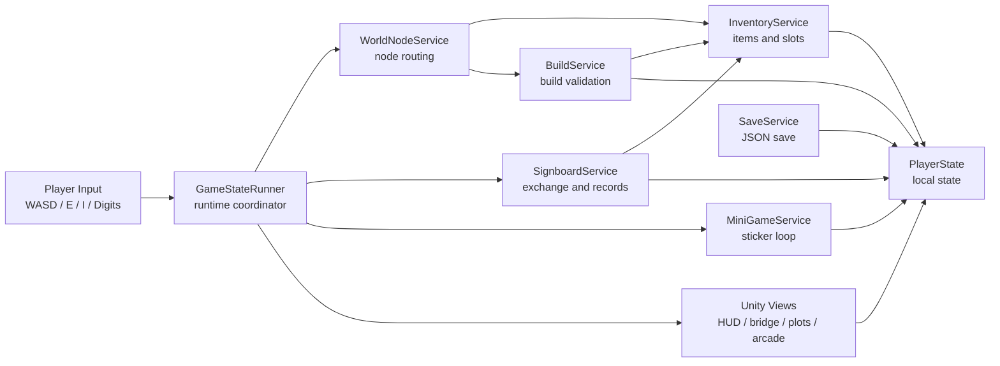

# 星绪森林

《星绪森林》是一款桌面端现代情绪冒险与小地图家园建设游戏。玩家从木屋前出发，在一张会持续变化的小岛地图里拾取材料、清理花园、修桥、建设小物件，并从家门口的游戏机进入像素贴纸小游戏，再把贴纸带回贴纸墙。

项目目标不是扩成多个主世界地图，也不是做任务清单驱动的流程游戏。第一版聚焦一个可反复打磨的主世界：木屋、木牌、森林、河流、木桥、花圃、贴纸墙和游戏机都在同一张地图里形成生活记忆点。对标只吸收方法：温和探索、材料改变世界、生活工具式 UI、入口后规则切换；不复制任何现有游戏素材、角色或 UI。

## 体验方向

- 靠近物件才出现短提示，不常驻“自由探索”说明。
- 第一次遇到某类可采集物时显示一次性引导；同类物品之后只保留短提示、背包数字和音效反馈，避免反复打断。
- 背包默认隐藏，按 `I` 打开；背包按分类分栏，使用 `← / →` 切换。
- 木牌是生活记录入口，不是任务板：今日可换、星币购买、出售收集物、图纸记录、小镇记录。
- `Tab` 打开装备圆环；只显示已经获得的装备/室内物品，不用空白格展示未获得内容。
- 木牌首日提供一次“今日赠礼”，让试玩版能主动获得修桥材料；发布版不在开局直接塞材料。
- 档案系统已预留：系统每 10 分钟自动记录一次档案，`F5` 可手动记录，最多保留 20 条；关键进度变化会写入自动存档。
- `Esc` 打开系统根菜单，包含存档、游戏设置和退出游戏；存档是二级菜单，退出游戏需要二次确认；自动存档可读取但不可删除。
- 未修桥前不能进入河道；修桥后只允许从桥面通过。
- 第一次发现断桥时，系统会用弱教程把修桥需要的备用木板放进背包；玩家再次点击断桥才执行修复。
- 修桥、开垦、贴纸收集、木牌买卖和装备更换等进度变化后会出现小反馈层，刷新提示和场景状态，不再保留旧触发文案。
- 清理花圃地块会分阶段移除落枝、碎石、杂草，并把材料放入背包。
- 建设失败不扣材料；建设成功后场景对象替换，贴纸墙和游戏机随状态变化。

## 背包分类

背包容量按“物品种类 + 3 个预留记录格”计算。当前 11 类物品对应 14 格。UI 采用分类页，不在开局一次性展开全部物品。

| 分类 | 用途 | 当前物品 |
| --- | --- | --- |
| 采集 | 从森林、河岸、河水直接获得 | 木材、石子、河贝、鱼 |
| 交换/货币 | 木牌兑换、买卖物资、进度纪念 | 星币、表情碎片、星屑灯芯、贴纸 |
| 建造种植 | 用于花圃、桥、路牌等建设链路 | 花种、木材、石子 |
| 装备/室内 | 装备圆环、游戏机、贴纸墙、未来室内布置入口 | 斧头、旧卡带、贴纸 |

开局只显示木材、石子、花种三个基础类型；河贝、鱼、星币、斧头、旧卡带、贴纸等必须收集、出售或购买后才显示。玩家可以在木牌出售木材、石子、河贝、鱼获得星币，再用星币购买木材、石子、花种或斧头。

## 玩家路径

1. 玩家从木屋前出生，看到木牌、贴纸墙、森林入口和河道。
2. 玩家靠近第一个材料，看到一次性“按 E 收进背包”引导。
3. 玩家按 `E` 采集，`InventoryService` 更新数量，HUD 显示短反馈并播放轻提示音。
4. 玩家靠近木牌按 `E`，木牌记录打开并授予初始图纸。
5. 玩家按数字键兑换今日赠礼或成长物资；失败只提示，不扣材料。
6. 玩家出售收集物换取星币，再购买需要的物资或斧头。
7. 玩家按 `Tab` 打开装备圆环；圆环只列出已获得装备，用数字键更换当前装备；后续树木/采集物交互可读取装备状态。
8. 玩家靠近半损坏木桥按 `E` 或鼠标左键，第一次发现断桥并获得备用木板；再次点击断桥，写入建设状态并显示修复后的桥。
9. 玩家从桥面通过河流，进入右侧空地发现游戏机。
10. 玩家拿到旧卡带后可自主进入像素小游戏，收齐贴纸再回到主世界。
11. 回家后贴纸墙更新，小镇记录和建设状态保留在本地存档；系统每 10 分钟自动留一条档案，并在关键进度点更新自动存档。
12. 玩家按 `Esc` 打开系统菜单，在自动存档和 3 个手动槽之间读取、保存或删除；自动存档不可删除。

## 操作

| 输入 | 行为 |
| --- | --- |
| `WASD` / `方向键` | 移动 |
| `E` / `鼠标左键` | 互动、采集、打开木牌、建设 |
| `I` | 打开/关闭背包 |
| `← / →` | 背包打开时切换分类 |
| `Tab` | 打开/关闭装备圆环 |
| `Backspace` | 装备圆环打开时收起当前装备 |
| `Esc` | 打开/关闭系统菜单 |
| `T` | 切换清晨、午后、夜晚 |
| `1-5` | 木牌打开后兑换当前条目 |
| `6-9` | 木牌打开后购买物资/斧头 |
| `Shift+1-4` | 木牌打开后出售收集物 |
| `F5` | 手动记录档案 |
| `S` / `L` / `Delete` / `Q` | 系统菜单中保存手动档、读取、删除手动档、保存并退出 |
| `Enter` | 游戏机菜单打开后进入小游戏 |

## 架构图



核心原则：服务层是唯一业务规则来源，Unity 场景对象只负责显示、靠近提示和把 `nodeId` 转发给服务层。

## 技术栈

| 层级 | 选型 |
| --- | --- |
| 引擎 | Unity 6 + URP |
| 语言 | C# |
| 输入 | Unity Input System |
| 存档 | 本地 JSON DTO，显式转换 `Dictionary` / `HashSet` |
| 存档槽 | `Application.persistentDataPath/Saves` 下的 1 个自动档 + 3 个手动档 |
| 测试 | Unity EditMode / PlayMode |
| 构建 | PowerShell 自动化脚本，Windows x64 构建和启动冒烟 |
| 视觉原型 | Unity 基础几何体 + URP Lit/Emission 材质 |
| 网页 | HTML/CSS/JavaScript 只作为概念展示，不反向主导 Unity |

## 目录

| 路径 | 说明 |
| --- | --- |
| `unity/` | Unity 工程主目录 |
| `unity/Assets/Scripts/Core/` | 状态、常量、物品和通用结果 |
| `unity/Assets/Scripts/Inventory/` | 背包容量、物品添加/消耗 |
| `unity/Assets/Scripts/Signboard/` | 木牌兑换、图纸入口和菜单快照 |
| `unity/Assets/Scripts/Building/` | 图纸、建设、自建建筑 |
| `unity/Assets/Scripts/World/` | 采集、钓鱼、世界节点路由 |
| `unity/Assets/Scripts/Runtime/` | Unity 场景薄视图层 |
| `unity/Assets/Editor/WorldHubSceneBuilder.cs` | 生成视觉可玩场景 |
| `unity/Assets/Tests/` | EditMode / PlayMode 自动测试 |
| `tools/` | Unity 测试、构建、验证脚本 |
| `assets/reference/` | 内部参考图归档，只用于方法分析 |
| `doc/` | 详细设计、对标 review 和运行指南 |

## 运行

Unity 手动试玩：

1. 用 Unity Hub 打开 `unity/`。
2. 打开 `Assets/Scenes/WorldHub.unity`。
3. 点击 Play。

完整自动验证：

```powershell
tools\run-stage6-validation.ps1
```

常用最小验证：

```powershell
tools\run-unity-editmode-tests.ps1
tools\run-unity-playmode-tests.ps1
tools\build-unity-windows.ps1
```

## 阶段路线

- 阶段 8B：视觉可玩主世界、非矩形小岛、河流阻挡、清理后建设花圃、背包隐藏。
- 阶段 8C：视觉/物理一致性、桥识别、河道缝隙修复、一次性引导和反馈降噪。
- 阶段 9：正式化角色代理、背包/木牌 Unity UI、授权音效、快照评分、试玩回路。
- 阶段 10：PC 可发布候选版，完成干净构建、下载后运行验证、存档路径验证、发布包说明和回归清单。
- 阶段 11：实机边跑边迭代，在发布候选版基础上继续优化体验、性能、场景功能和玩家反馈闭环。

## 质量门禁

- 视觉/交互 review 以 `doc/visual_benchmark_review_stage8.md` 为准。
- 每个可试玩切片先修阻断问题，再进入下一阶段。
- 任一维度低于门槛时，不新增玩法，先修画面、物理或反馈。
- 禁止范围：战斗、抽卡、联网、账号、多主世界地图、复制参考游戏素材或 UI。
